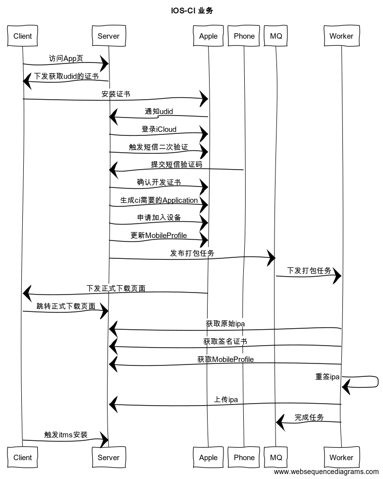

# ios的打包辅助工具
应测试开发的需求, 提供一个方便机器注册至调试设备并快速安装流程的服务

# Feature List
功能慢慢增加
 - [x] 基础功能
 - [ ] 减少iCloud账号登录的次数
 - [x] 支持CDN下载ipa 
 - [x] 虚拟的CDN下载进度
 - [x] 准确的下载进度
 - [ ] 定制预估的安装时间
 - [ ] 最小化Mac环境下的打包
 - [ ] Linux平台打包
 - [ ] 减少重复打包
 - [ ] ipa合法性验证
 - [x] 定制bundleId前缀
 - [ ] 图形化上传工程
 - [ ] 图形化上传证书
 - [x] 手工上传工程
 - [x] 手工上传证书
 - [ ] 全自动上传证书
 - [ ] 批量账号导入
 - [ ] 合并重复打包
 - [ ] 100并发合并优化(因为测试账号单个最多100个设备)
 - [ ] 打包终端HA
 - [ ] k8s迁移
 - [ ] 过期/历史ipa清理
 - [ ] 账号自动续约
 - [ ] 账号续约通知
 - [ ] 账号池管理后台
 - [ ] 猫池卡池接入
 - [ ] 下载页定制后台
 - [ ] 平台统计报表
